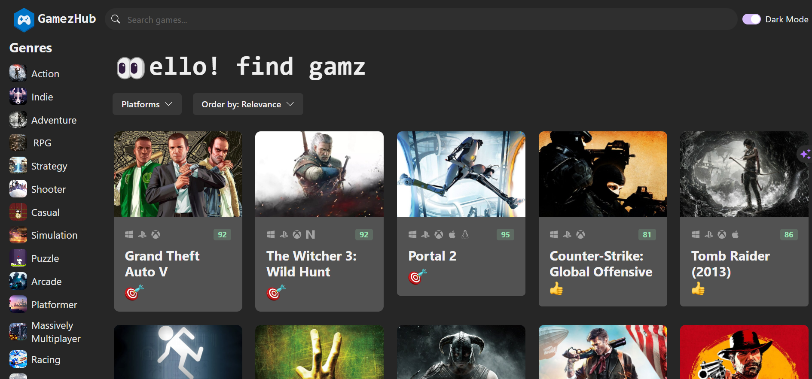

# gamez-hub

A web applicatin created using: 
* React.js
* ChakraUi for design and appearance
* Rawg api for game data and images

## Features
* Light and dark theme
* List games
* Search Games
* Games list by genre it's data is static so it's bundled with the applicatin no need to recall the api
* Filter Games by Platform
* Sort games by date, rating, etc.

## Practices
* Clean code
* Best practices
* Performance oriented

## Dependencies
* Axios for api calls

### Light Home

### Dark Home
