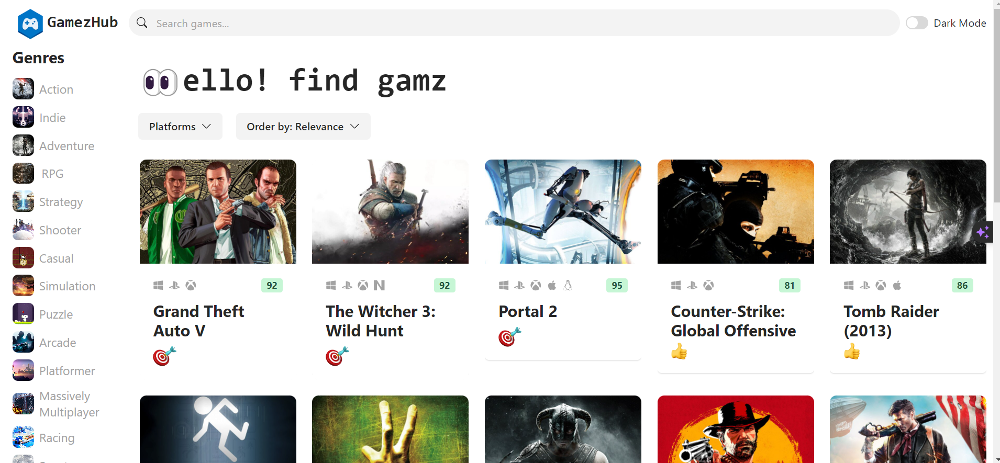
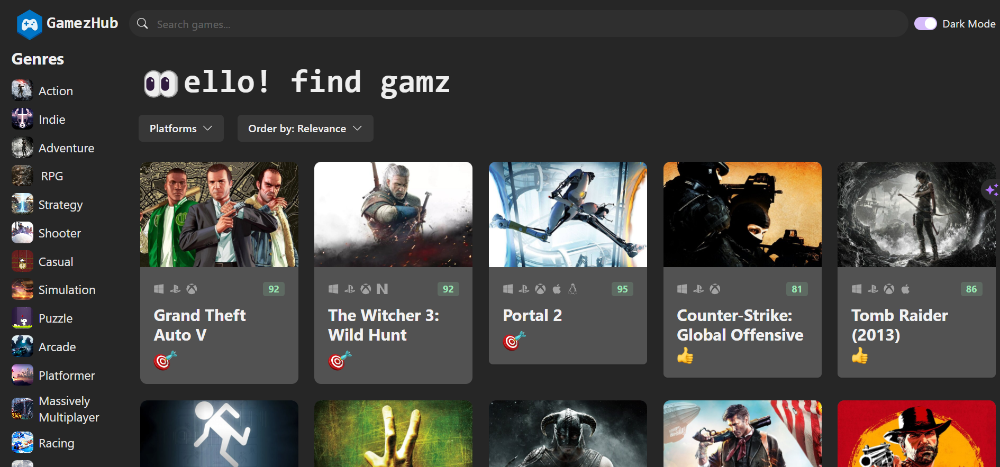
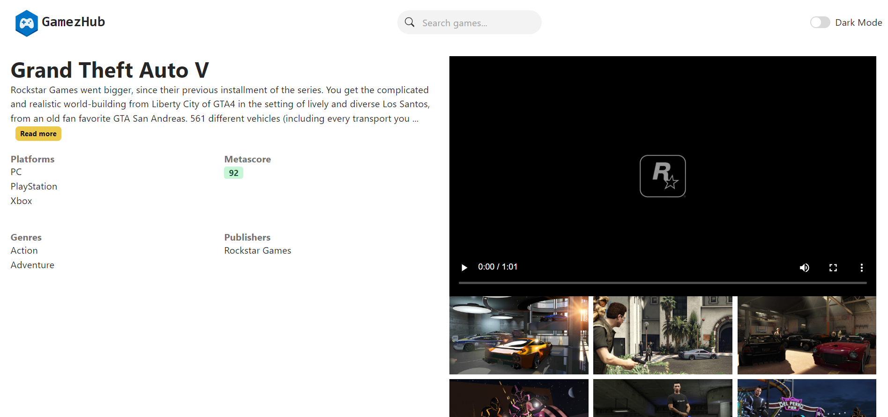

# Gamez-Hub

Gamez-Hub is a web application built using modern technologies to provide a seamless gaming experience. Below are the details of the application, its features, practices, and dependencies.

## Technologies Used
* **React.js:** A JavaScript library for building user interfaces, providing a fast and interactive experience.
* **Chakra UI:** Used for designing and styling the application, ensuring a visually appealing and responsive layout.
* **Rawg API:** Integrated to fetch game data and images, enhancing the application with up-to-date information.
* **React Router:** Facilitates navigation within the application, ensuring a smooth transition between different pages.

## Features

### Light and Dark Theme
Toggle between light and dark themes to enhance user experience and accommodate different preferences.

### Game Listing
Browse through a comprehensive list of games, complete with relevant details and cover images.

### Game Search
Effortlessly search for your favorite games using a robust search feature.

### Genre-specific Game Lists
Access static game lists categorized by genre, providing a curated collection of games without the need for real-time API calls.

### Platform-based Game Filtering
Filter games based on platforms, allowing users to find games compatible with their preferred gaming systems.

### Sorting Options
Sort games by various criteria such as release date, rating, and more, providing flexibility in exploring the game catalog.

### Infinite Scroll with Pagination
Enjoy a seamless browsing experience with infinite scroll functionality and pagination for efficient navigation.

## Best Practices and Performance

### Clean Code
Follows best coding practices to maintain readability, modularity, and scalability.

### Performance Optimization
Prioritize performance to ensure a smooth user experience, minimizing load times and optimizing resource utilization.

## Dependencies

* **Axios:** Utilized for efficient API calls, streamlining data retrieval from the Rawg API.

## Screenshots

### Light Theme

### Dark Theme

### Game Page

Feel free to contribute or provide feedback to enhance the Gamez-Hub experience!